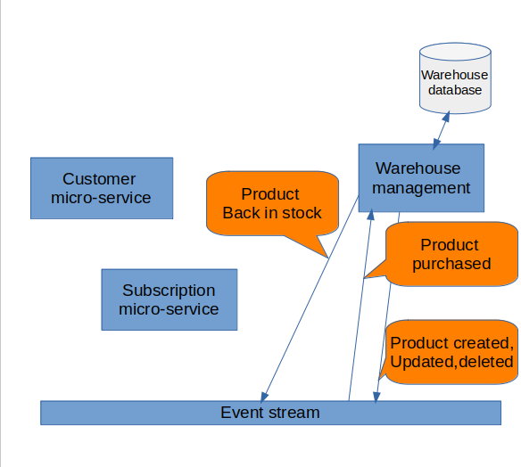

## Architecture

<center></center>

In this repository we will implement the warehouse management microservice using NestJS framework, MySQL database and Redis to read and sent events to the event stream.  
Operations supported by this microservice are products creation, removing and updating.

## Requirements

in the context of a backend solution of an online shopping web application that revolves around the following main usecases:

- A customer can view products.

- A customer can make purchases.

- A customer can view and update his/her shopping cart.

- A warehouse manager can manage inventory by viewing the list of products, adding new ones or removing existing ones.

- In case a product is out of stock, a customer can subscribe to that product and once it is back in stock, he/she is notified through an email.

## Events

- ProductBackInStock: event sent to the event stream and consumed by the subcription micro-service to notify users
- ProductPurchased: event consumed by our microservice to synchronize the Products database connected to it
- ProductCreated, ProductUpdated, ProductDeleted: events sent to the event stream to notify the consumer microservice so that it synchronizes its Product database connected to it.

## Installation

Prerequisites:
You should have MySQL and npm installed.  
=> Create a database called warehouse.

```bash
$ npm install
```

## Running the app

```bash
$ npm run start
```
